# SPRING PLUS

## Lv.12 AWS 활용 첨부내용  

### Lv.12-1 EC2  
#### EC2 Instance  
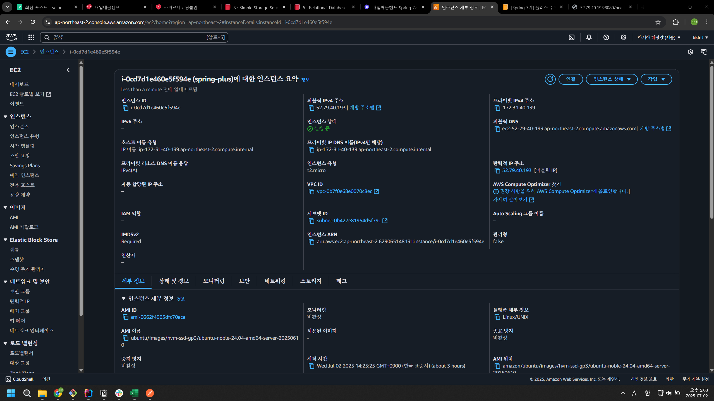  
#### EC2 Inbound  
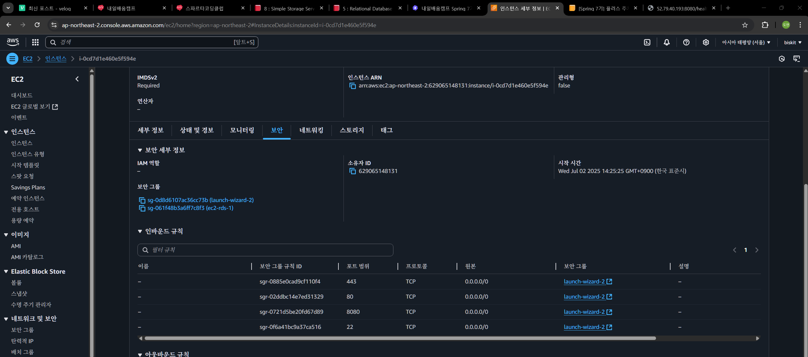
#### HealthCheckApi 실행 결과 
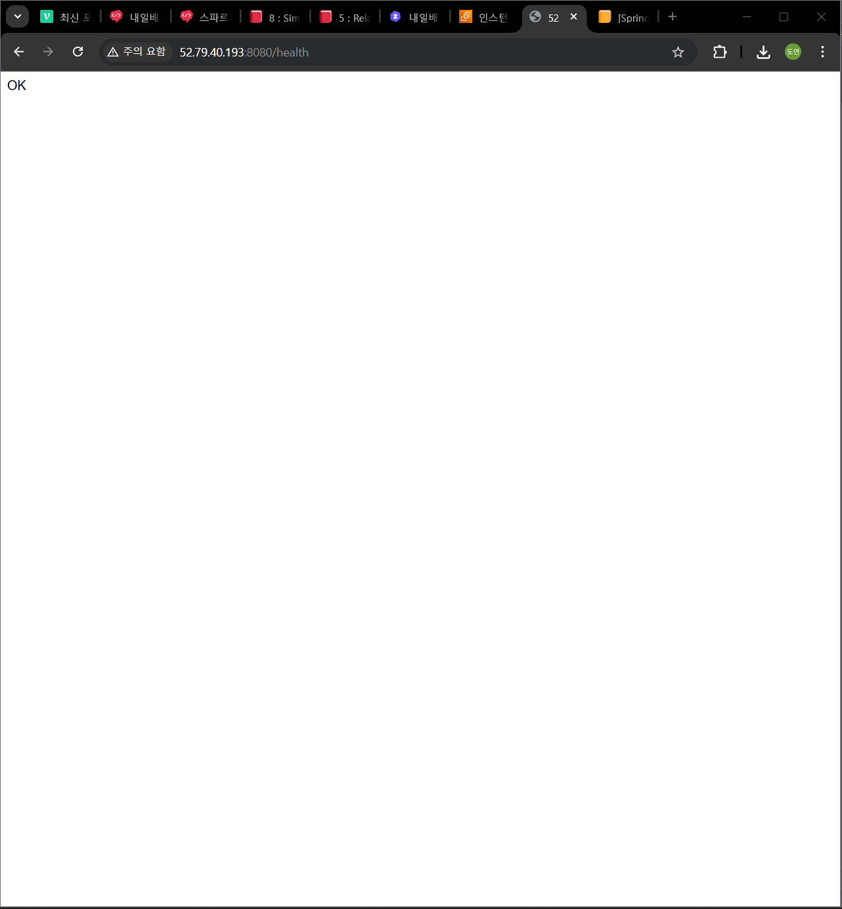
##### Web 실행  
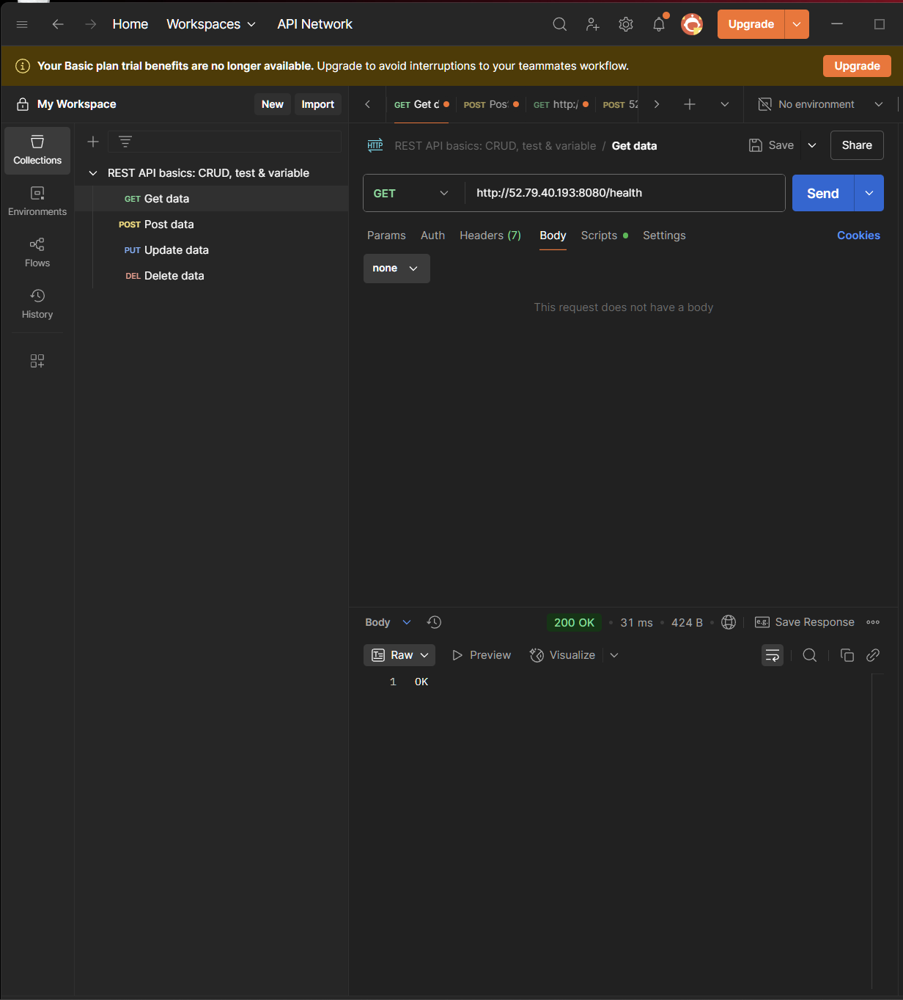
##### Postman 실행  

### Lv.12-2 RDS  
#### RDS Setting
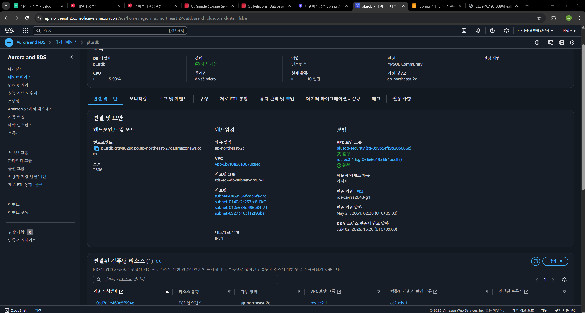    
#### RDS Connect  
  

### Lv.12-3 S3
#### Bucket Setting  
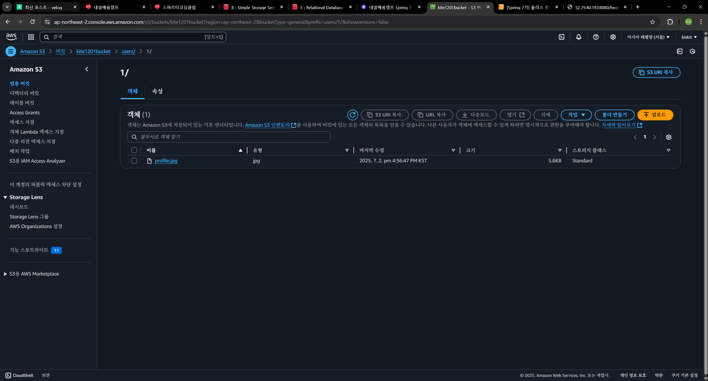  
#### Bucket Connect 결과  
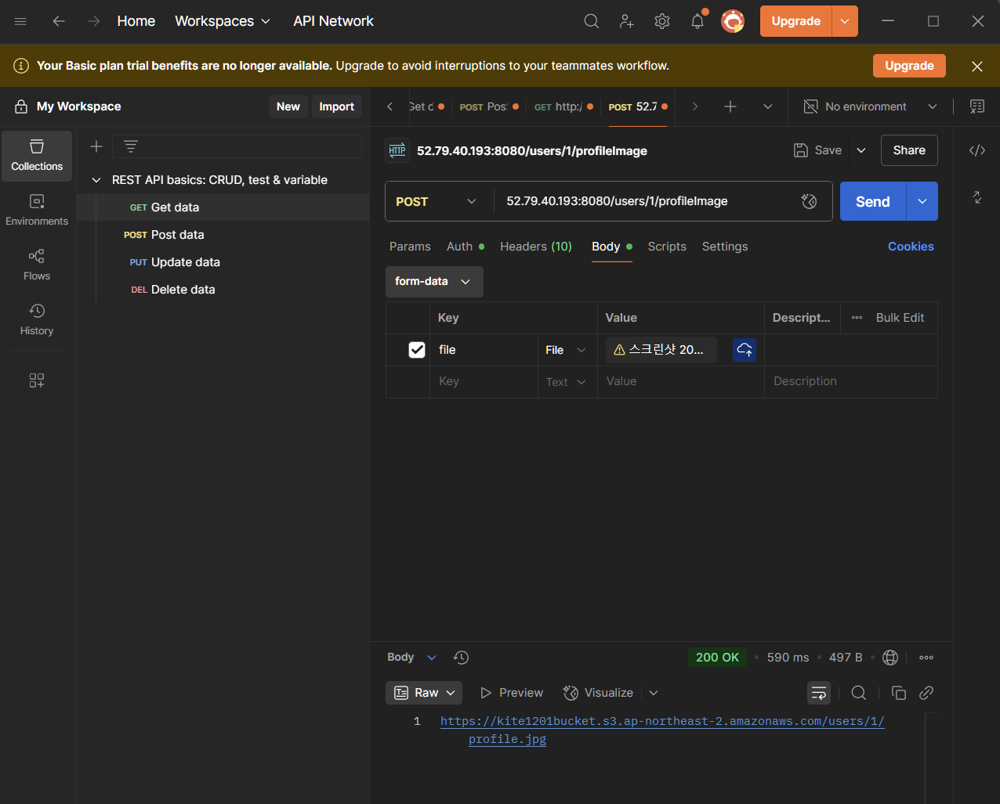

## Lv.13 대용량 데이터 처리 첨부내용
### 초기 조회 속도
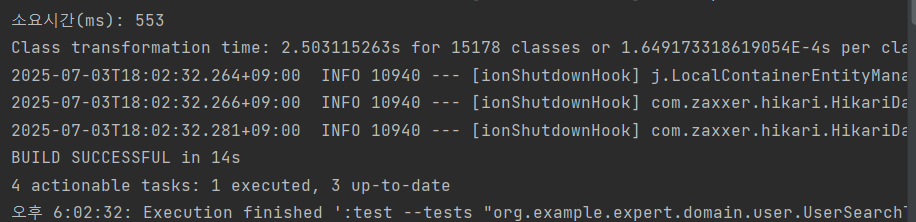  

### 인덱싱 사용
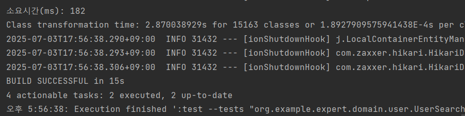  

### 특정 컬럼(id, email, nickname)만 검색  
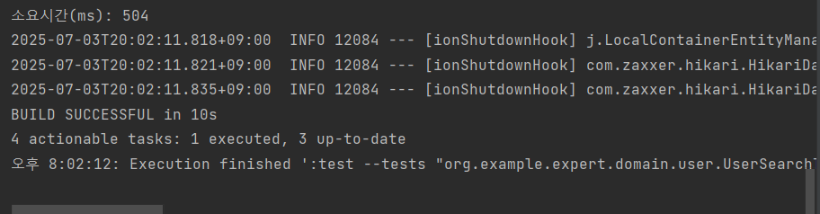  

### 인덱싱 + 특정 컬럼만 검색
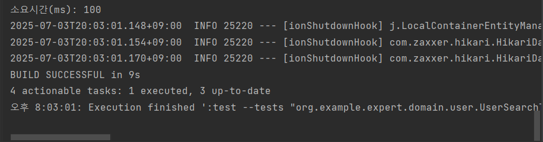
#### 결과
유의미하게 결과에 차이가 나는 것은 인덱싱 기능을 사용했을 때 이며,  
특정 컬럼만 검색의 경우 약 3~5ms 정도의 차이만 보였다.
